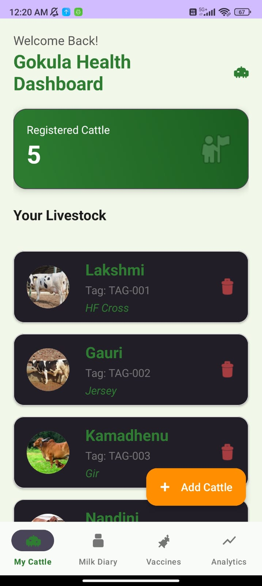
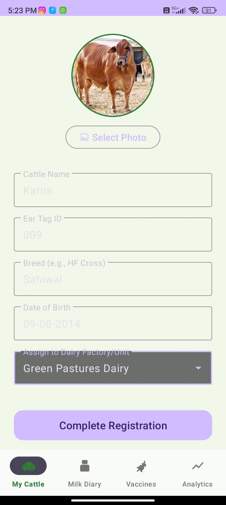
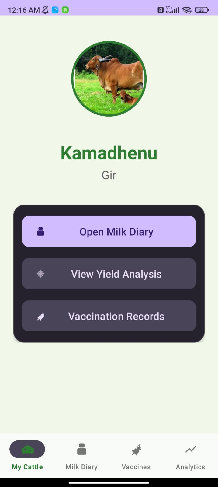
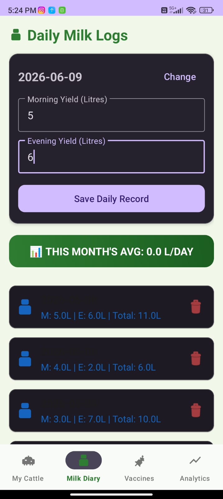
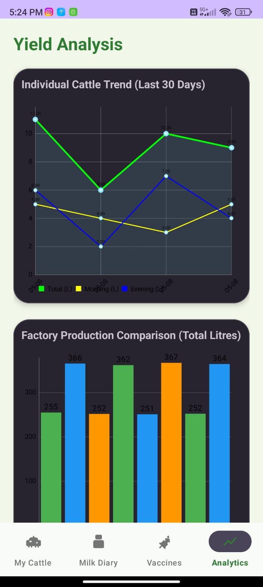
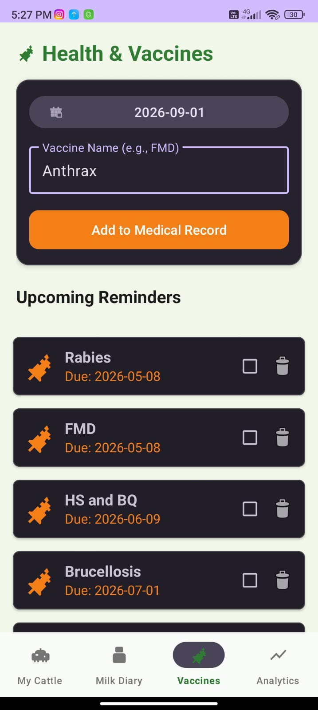

# GokulaHealth 🏥🐄 [](https://kotlinlang.org/) [](https://developer.android.com/) [](https://developer.android.com/about/dashboards) [](LICENSE)

**GokulaHealth** is a specialized Android application designed for efficient cattle farm management. It streamlines milk production tracking, healthcare scheduling, and livestock analytics, helping farmers maintain a healthy and productive herd through a modern, data-driven approach.

---

## 🧐 Why GokulaHealth?

Traditional farm management often relies on manual paper logs, which are prone to errors and difficult to analyze. **GokulaHealth** bridges this gap by providing:
* **Data Accuracy**: Digital logs for milk and health eliminate guesswork.
* **Proactive Healthcare**: Never forget a vaccination with automated reminders.
* **Economic Insights**: Understand your production trends to optimize farm profitability.
* **Accessibility**: Designed for rural areas with full offline functionality.

---

## 🌟 Key Features

### 🐄 Herd Management
* **Digital Livestock Profiles**: Comprehensive tracking of individual cattle details (Breed, Age, Health status).
* **Searchable Database**: Quickly find and manage specific animals within large herds.

### 🥛 Milk Production Tracking
* **Daily Log**: Easy entry for Morning and Evening milk yields per animal.
* **Automated Calculations**: Real-time calculation of total daily production.

### 📊 Advanced Analytics
* **Yield Trends**: Interactive **Line Charts** visualizing production over time (Total, Morning, and Evening).
* **Factory Insights**: **Bar Charts** comparing milk supply across different factories for optimized distribution.
* *Powered by [MPAndroidChart](https://github.com/PhilJay/MPAndroidChart)*.

### 💉 Healthcare & Vaccination
* **Smart Scheduler**: Track vaccination history and upcoming doses for every animal.
* **Automated Reminders**: Integrated **WorkManager** and **Notifications** ensure you never miss a critical vaccine.

### 🔐 Offline-First Reliability
* **Robust Data**: Full offline capability using **Room Database**, essential for remote farm locations.
* **Background Sync**: Architecture ready for future cloud synchronization.

---

## 📸 Screenshots

<p align="center">
  
  
  
</p>

<p align="center">
  
  
  
</p>

---

## 🛠️ Tech Stack & Architecture

* **Language**: [Kotlin](https://kotlinlang.org/) (100%)
* **Architecture**: MVVM (Model-View-ViewModel) + Clean Architecture
* **UI**: XML Layouts with **Material Design 3**
* **Local DB**: [Room](https://developer.android.com/training/data-storage/room) (v2.8.4)
* **DI**: [Dagger Hilt](https://dagger.dev/hilt/) for dependency injection
* **Background Processing**: [WorkManager](https://developer.android.com/topic/libraries/architecture/workmanager) for notification scheduling
* **Navigation**: [Jetpack Navigation](https://developer.android.com/guide/navigation) with Safe Args
* **Charts**: [MPAndroidChart](https://github.com/PhilJay/MPAndroidChart)
* **Image Loading**: [Glide](https://github.com/bumptech/glide)

---

## 🏗️ Core Components

* **Room Persistence**: Stores cattle information, milk logs, and vaccination schedules locally.
* **Hilt Dependency Injection**: Decouples components for better testability and scalability.
* **LiveData & Coroutines**: Ensures smooth UI updates and efficient background data handling.
* **WorkManager**: Handles precise scheduling for vaccination alerts, ensuring they fire even if the app is closed.

---

## 📂 Project Structure

```text
GokulaHealth/
├── app/
│   ├── src/main/java/com/bhagyashreereddy/gokulahealth/
│   │   ├── data/           # Room entities, DAOs, and Repositories
│   │   ├── di/             # Hilt dependency injection modules
│   │   ├── notification/   # WorkManager and Notification helpers
│   │   ├── ui/             # Fragments & ViewModels (Feature-based)
│   │   │   ├── admin/      # Farm management dashboard
│   │   │   ├── cattle/     # Livestock list and details
│   │   │   ├── graph/      # Performance analytics & Charts
│   │   │   ├── milk/       # Milk production logging
│   │   │   └── vaccination/ # Health & schedule management
│   │   └── utils/          # Formatting & helper classes
│   └── src/main/res/       # Layouts (XML), Navigation Graph, and Assets
```

---

## 🚀 Roadmap

- [ ] **Cloud Sync**: Firebase integration for data backup and multi-device support.
- [ ] **PDF Reports**: Export monthly milk production and health reports.
- [ ] **AI Insights**: Predictive analytics for future milk yield based on history.
- [ ] **Multi-language Support**: Adding Hindi and Kannada for local farmers.

---

## 🚀 How to Run

Follow these steps to get the project up and running on your local machine.

### 📋 Prerequisites
* **Android Studio**: [Ladybug (2024.2.1)](https://developer.android.com/studio) or newer.
* **JDK**: Version 17.
* **Android SDK**: API Level 34 (Android 14) recommended.
* **Device**: A physical Android device or Emulator running **API 24 (Android 7.0)** or higher.

### 📥 Installation
1. **Clone the repository**:
   ```bash
   git clone https://github.com/Bhagyaabbigeri/GokulaHealth.git
   ```
2. **Open the Project**: Launch Android Studio and select **Open**, then navigate to the cloned `GokulaHealth` directory.

### 🔨 Building the Project
1. **Sync Gradle**: Once the project opens, wait for the automatic Gradle sync to complete. If it doesn't start, click **File > Sync Project with Gradle Files**.
2. **Build**: Click on **Build > Make Project** (or press `Ctrl+F9`) to compile the app.

### 🏃 Running the App
1. **Connect Device**: Plug in your Android device via USB (with Developer Options and USB Debugging enabled) or start an Emulator.
2. **Select Run Configuration**: Ensure the `app` module is selected in the run configuration dropdown.
3. **Launch**: Click the **Run** button (green play icon) or press `Shift+F10`.
4. **Grant Permissions**: Upon first launch, the app may request notification permissions to provide vaccination reminders.

---

## 🤝 Contributing
Contributions are what make the open source community such an amazing place to learn, inspire, and create.

1. Fork the Project
2. Create your Feature Branch (`git checkout -b feature/AmazingFeature`)
3. Commit your Changes (`git commit -m 'Add some AmazingFeature'`)
4. Push to the Branch (`git push origin feature/AmazingFeature`)
5. Open a Pull Request

---

## 📄 License
Distributed under the **MIT License**. See `LICENSE` for more information.

---
Developed with ❤️ by [Bhagyashree Reddy](https://github.com/Bhagyaabbigeri)
